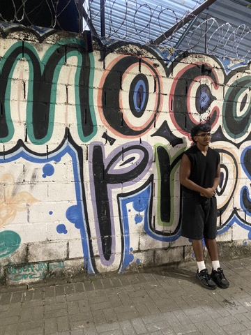
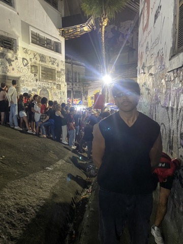

  

<h2 align="center">👨‍💻 About Me</h2>

  Hi, I'm <strong>Adarsh Kumar</strong>, a <strong>Management Engineering student at the University of Waterloo</strong> and an <strong>Incoming Software Engineering Intern at Ford Motor Company</strong>.

  I enjoy working across the stack, from backend services and distributed systems to embedded telemetry tools and data pipelines. Whether it's deploying cloud infrastructure, optimizing ETL workflows, or debugging firmware, I enjoy solving challenging engineering problems.

  Outside of engineering, I'm passionate about travelling, rugby, and cheering for Arsenal, the Toronto Raptors, the Carolina Panthers, and the Toronto Blue Jays.

  
  
  

---

<h2 align="center">🎧 Currently Listening</h2>

  

---

<h2 align="center">🚀 Experience</h2>

  🚙 <strong>Incoming Software Engineering Intern</strong> @ Ford Motor Company 
  🏎️ <strong>Software Engineer</strong> @ UW Formula Electric 
  ☁️ <strong>Former Data Engineering Intern</strong> @ Canso Investment Counsel 
  💻 <strong>Former Software Engineering Intern</strong> @ CareMetric Solutions 
  🌱 <strong>Former Process Engineering Intern</strong> @ Dryden Fiber Canada

---

<h2 align="center">🛠 Tech Stack</h2>

<h3 align="center">Languages</h3>

  

<h3 align="center">Frameworks & Libraries</h3>

  

<h3 align="center">Cloud & DevOps</h3>

  

<h3 align="center">Databases</h3>

  

<h3 align="center">Data, Cloud & Engineering Tools</h3>

  
  
  
  

  
  
  
  

  
  
  
  

---

<h2 align="center">🤝 Connect With Me</h2>

  
  
  

